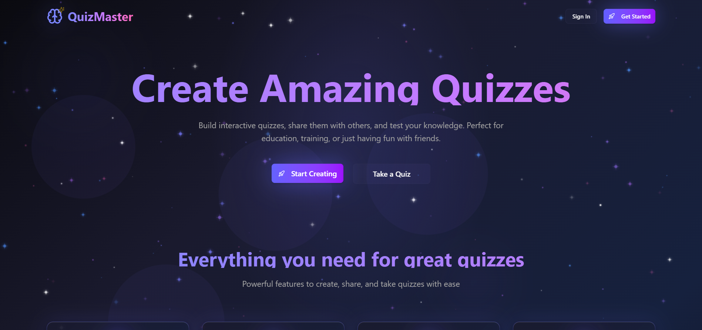

# 🎯 Online Quiz Application  




[](https://quizapp-master.vercel.app/)  
  
  
  
  

An interactive quiz web app built with **Vite + React**.  
Test your knowledge with multiple-choice questions and track your score instantly.  

---

## 🚀 Live Demo  
👉 [Quiz App](https://quizapp-master.vercel.app/)  

---

## ⚡ Features  
- 📝 Multiple-choice quiz questions  
- ⏱️ Timer-based quiz flow (if you added)  
- 📊 Instant score calculation  
- 🎨 Responsive UI with modern styling  
- ⚡ Built with Vite for blazing-fast performance  

---

## 🛠️ Tech Stack  
- **Frontend**: React, Vite  
- **Styling**: CSS / Tailwind (if you used)  
- **Deployment**: Vercel  

---

## 📦 Installation & Setup  

Clone the repo and install dependencies:  

```bash
git clone https://github.com/Priyanka-2509/Quiz-app.git
cd Quiz-app
npm install
npm run dev
The app will be available at http://localhost:5173/


👩‍💻 Author
Priyanka Kumari

GitHub: @Priyanka-2509